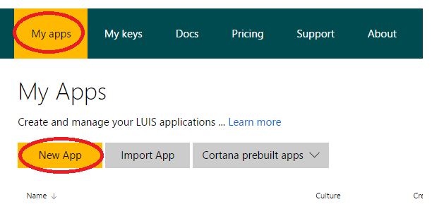
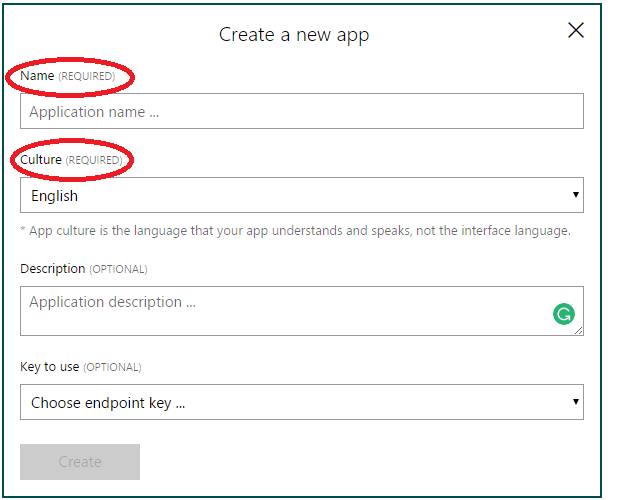
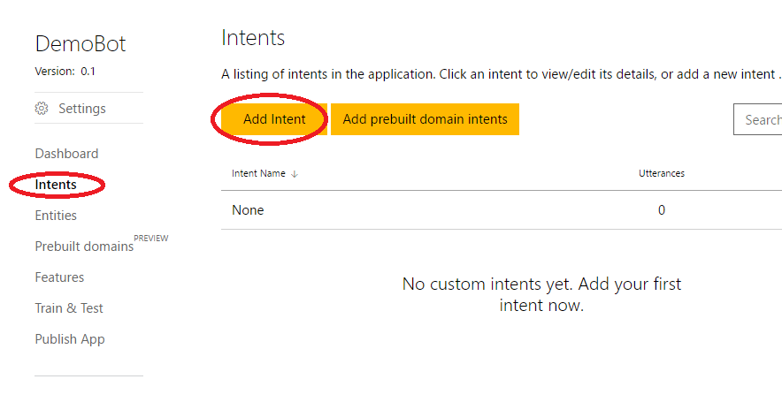
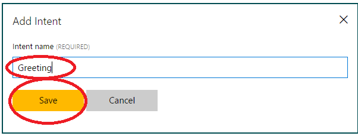
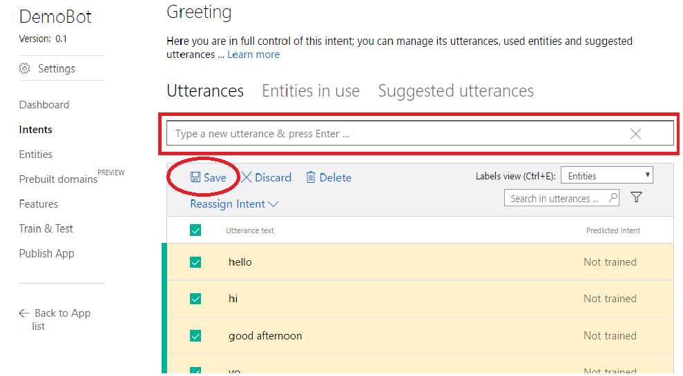
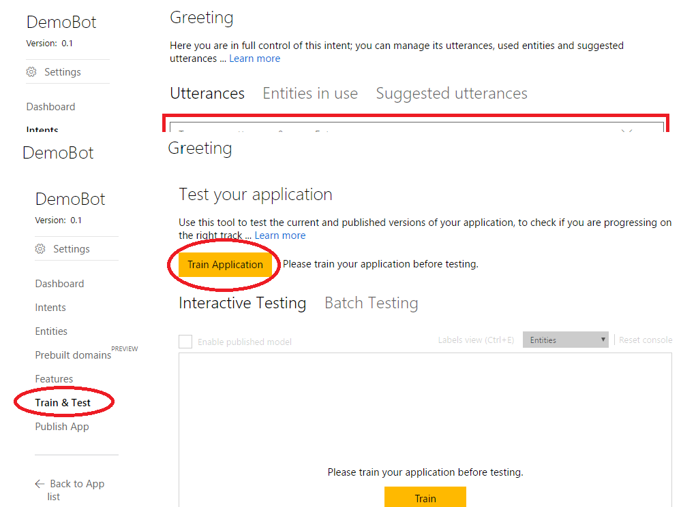
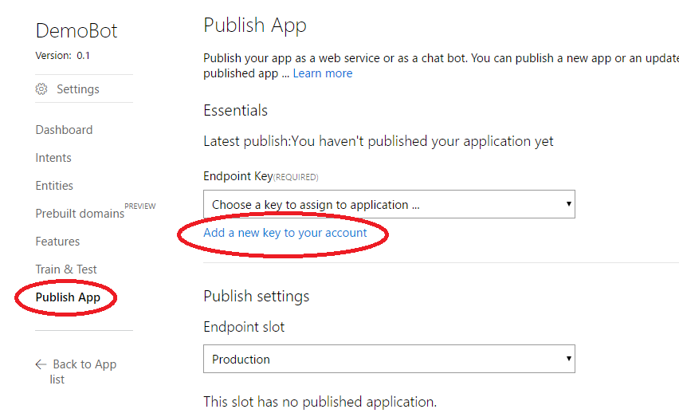
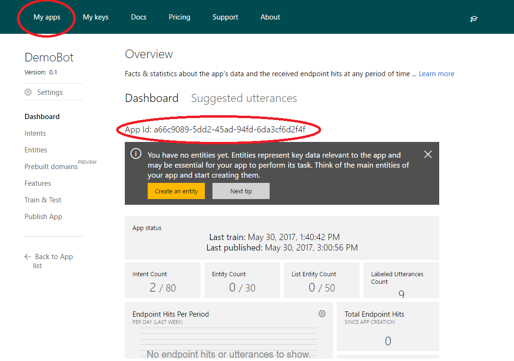
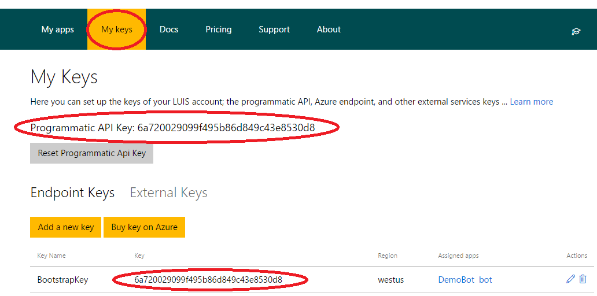


> [!IMPORTANT]
> The Bot Builder SDK for .NET currently supports C#. Visual Studio for Mac is not supported.

## Prerequisites


##LUIS.api
Now we will create your LUIS account, navigate to [LUIS.ai](https://www.luis.ai/home/index). 
####Now that you have created an account:
1. Click on **My apps** and then **New App**.   

2. Fill in the appropriate fields in the Create a new app window. **Click Create**   (If you do not have a Key we will make one later)  


3. You will now be at the dashboard for your application.  Take a minute to familiarize yourself with the dashboard
4. In the side menu click on **Intents**,  now click **Add Intent**

6. In the prompt type "Greeting" and click **Save**  


####You will now be on the utterances page
Utterances is what you expect your end users to say to invoke your intents. In Keep in mind LUIS intents, as in natural language there are many ways to say the same thing.  Luis allows for multiple utterances, up to 8000 for the entire model.   Keep in mind that users will use things like slang and jargon when you create utterances.  As an example in our greeting intent we will add "Hello" and "Yo" to our model.  Also keep in mind other variations of you utterances such as the seasonal "Seasons Greetings" during winter.  (For a deeper dive into the concept of utterances take a look at [Benjamin Perkins blog post](https://blogs.msdn.microsoft.com/benjaminperkins/2016/12/13/1000-must-have-utterances-for-your-chatbot-using-luis/))

1. In the utterance text box add any greeting you can think of.  Some examples might be, "Hello", "Hi", "Good Afternoon", "Yo", "What's up", "Hello there", Etc.  
 When you have entered in all you utterances click **Save**  

2. Now click on **Train & Test** in the side menu  
   Click **Train application**.  


You may now test your LUIS model by typing in the consoles and hitting enter.  We have only trained one intent, so pretty much anything you type in will come up as a greeting.  For example type in "hjkl;lkjh" or "Legit Nachos" and they will evaluate to the greeting intent.  More on this in a later blog post.  For now we are going to publish our LUIS model.

1. Click on **Publish App** on the side menu and underneath the endpoint key dropdown menu, click **Add a new key to your account**.  If you already have a key you can skip these steps.  
  
2. on the next screen click on **Buy key on azure**  At the time of writing this there is a free tier of key that allows for up to 10,000 endpoint hits per month.  If you exceed 10,000 you will incur charges.  but for most test applications this will be more than enough.  You will need an Azure account to complete this step.
3. Follow the wizard on Azure to finish purchasing your key  
  **(return to the publish tab)**
4. From the Endpoint Key dropdown select **bootstrap key**
5. Now click publish

Congrats! You have published your first LUIS model.
Now let's link your bot code and LUIS.


    
**In the following code you will need to replace the namespace with your namespace, and the same with your bot's app ID and your Key.**   
you can find your app ID under the my apps tab on the top menu, then click on your bot:   
  
you can find your key under the My Keys tab at the top of the page  
  
  
 **Replace the code in your RootDialog,cs (in your dialogs folder) with this:**


```cs
using System;  
using System.Threading.Tasks;  
using Microsoft.Bot.Builder.Dialogs;  
using Microsoft.Bot.Builder.Luis;  
using Microsoft.Bot.Connector;
using Microsoft.Bot.Builder.Luis.Models;  

namespace bot.Dialogs //you will have to make this match your namespace
{
    [Serializable]
    [LuisModel("a66c9089-5dd2-45ad-94fd-6da3cf6d2f4f", "0d83748026724b16884080380bb3f5a0")] //[LuisModel("BOT ID", "KEY")]
    public class RootDialog : LuisDialog<object>
    {
        [LuisIntent("None")]
        public async Task None(IDialogContext context, LuisResult result)
        {
            await context.PostAsync("I'm sorry. I didn't understand you.");
            context.Wait(MessageReceived);
        }

        
        [LuisIntent("Greeting")]
        public async Task Greeting(IDialogContext context, LuisResult result)
        {
            await context.PostAsync("Hello Friend");
            context.Wait(MessageReceived);
        }
    }
}
```








